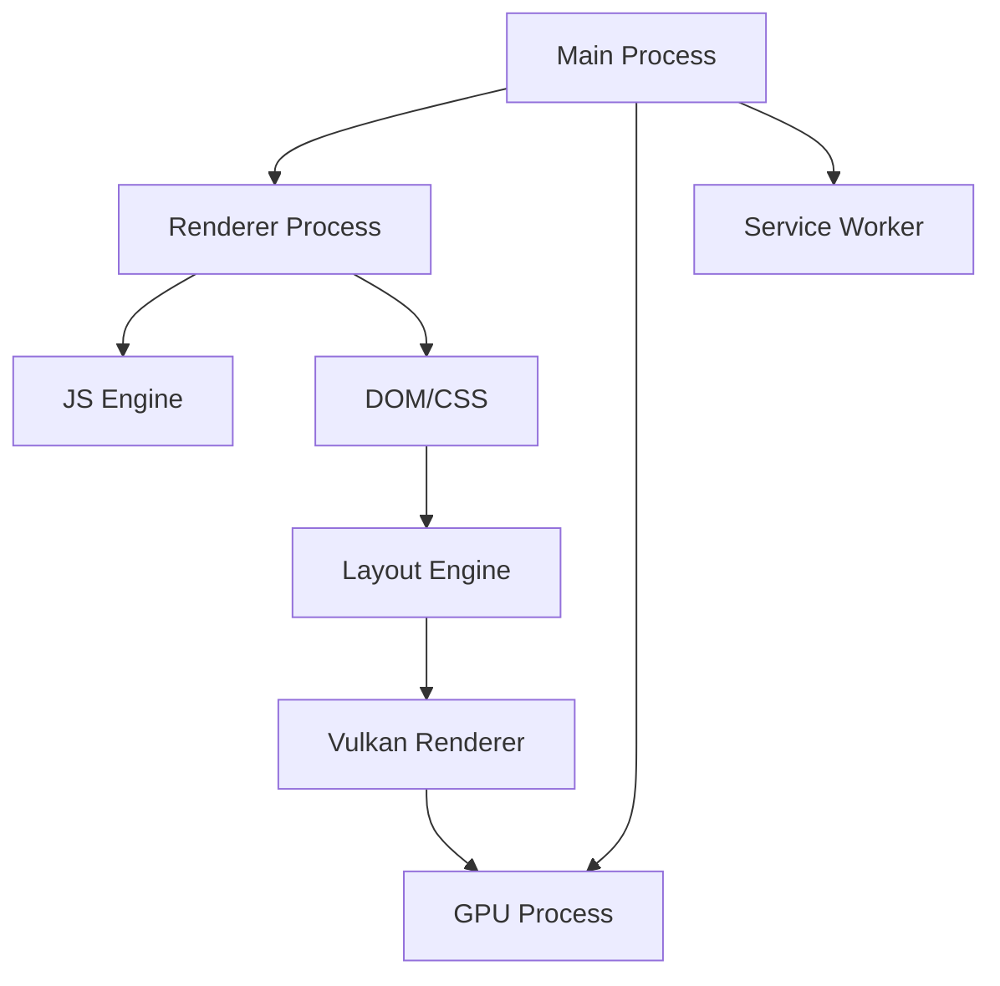

# Architecture Overview

## Core Design Principles

### 1. Multi-Process Architecture
- **Main Process**: UI, coordination, security policy
- **Renderer Processes**: Web content rendering (sandboxed)
- **GPU Process**: Vulkan command execution
- **Service Worker Processes**: PWA background tasks

### 2. Vulkan Graphics Pipeline
```
HTML/CSS → Layout → Paint → Vulkan Commands → GPU → Display
```

### 3. JavaScript Engine Integration
- V8 JavaScript engine with custom bindings
- JIT compilation pipeline for hot code paths
- Garbage collection coordination with Rust

### 4. Security Model
- Process-level sandboxing
- Capability-based permissions
- IPC message validation
- Memory protection

## Module Interactions

